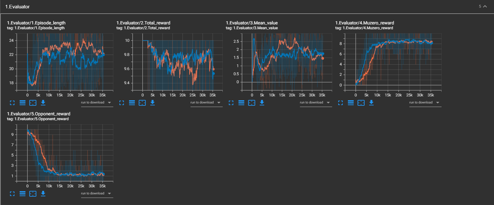
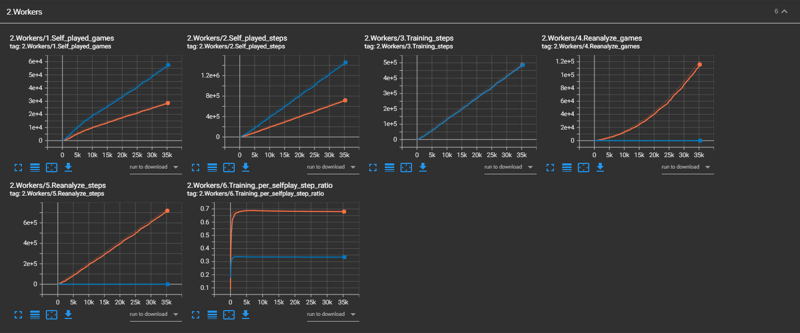

# MuZero-CPP
This project is a complete C++ implementation of the [MuZero](https://arxiv.org/abs/1911.08265) algorithm, inspired by the work done by [MuZero General](https://github.com/werner-duvaud/muzero-general). 
The motivation behind this project is for the added speed C++ provides, efficient batched inference on the GPU, as well as working in C++ environments where we don't want to leave the C++ runtime. 
There are still many optimization tricks that can be used to improve efficiency, but there aren't immediate plans to do so.

## Features
- Multi-threaded async actor inference
- Multiple device (CPUs and GPUs) support for learning and inference
- Reanalyze for fresh buffer values
- Complex action representation options
- Priority replay buffer
- Tensorboard metric logging
- Model, buffer, and metric checkpointing for resuming
- Easy to add environments
- Play against the learned model (2 player games) in testing

## Dependencies
The following libraries are used in this project. They are included as git submodules (minus libtorch), so it is recommended you install them by using the `git --recursive` argument.
- [abseil-cpp](https://github.com/abseil/abseil-cpp/tree/ec0d76f1d012cc1a4b3b08dfafcfc5237f5ba2c9) (ec0d76f)
- [libnop](https://github.com/google/libnop/tree/35e800d81f28c632956c5a592e3cbe8085ecd430) (35e800d), also requires `protobuf-compiler` and `libprotobuf-dev`
- [tensorboard_logger](https://github.com/RustingSword/tensorboard_logger/tree/11d2b46c66c55c2a1b7a2dae43179f01b908bf5a) (11d2b46)
- [libtorch](https://pytorch.org/)

Some source files are also taken from (and) modified [OpenSpiel](https://github.com/deepmind/open_spiel), and have the corresponding Copyright notice included as well.

## Installing
These instructions will help you install the program. It should compile fine on most systems, but YMMV. The following systems have been tested on:
- Ubuntu 20.04: gcc/g++ 9.3.0, Clang/Clang++ 10.0.0, libtorch (10.0, CUDA 11.3)
- macOS Catalina 10.15.2: Apple Clang 11.0.0, libtorch (10.0, CPU)

There are issues if trying to compile on gcc/g++ 8.4 which has a segfault with `<filesystem>`.

First, install [libtorch](https://pytorch.org/).
Then, follow the below steps and replace the libtorch path with one which matches your system. This will compile a library which can be included in your projects (see example usage below).
```shell
# Install dependencies for tensorboard logging
sudo apt install protobuf-compiler
sudo apt install libprotobuf-dev

# Clone this repository
$ git clone --recursive https://github.com/tuero/muzero-cpp.git

# Enter the repository
$ cd muzero-cpp

# Compile
$ mkdir build && cd build
$ cmake -DCMAKE_PREFIX_PATH=/usr/local/libtorch -DCMAKE_BUILD_TYPE=Debug ..
# or
$ cmake -DCMAKE_PREFIX_PATH=/usr/local/libtorch -DCMAKE_BUILD_TYPE=Release ..
$ make -j$(nproc)
```

## Example Usage
Included are a few examples which show how to add a new environment, and interact with the learning and testing. 
There are predefined command line arguments to parameterize the MuZero algorithm (see [default_flags.cpp](./muzero-cpp/default_flags.cpp) or use the --help option when running).  Note that the devices are listed as comma separated, following the `torch` notation.
You can also add additional command line arguments by adding `ABSL_FLAG`s (see the examples).

Some important arguments to consider:
- `path` The directory which will be used for checkpointing and resuming.
- `devices` Torch style comma separated list of devices (with the first listed being prioritized for training). E.g. 
    - `--path "cuda:0,cuda:1"`
    - `--path "cpu"`
- `min_sample_size` Should be at least as big as `batch_size`
- `num_actors` Number of actor threads to spawn. It is also recommended to have `initial_inference_batch_size` and `recurrent_inference_batch_size` equal to the number of actors, as this will increase the efficiency by batching inference queries rather than having threads wait for a model to become available.

### Training
One can train Connect4 by the following:
```shell
$ cd build

# Run the connect4 binary with the appropriate arguments
$ ./examples/connect4/muzero_connect4 --num_actors=10 --initial_inference_batch_size=10 --recurrent_inference_batch_size=10 --devices="cuda:0" --batch_size 256 --min_sample_size=512 --value_loss_weight 0.25 --td_steps=42 --num_unroll_steps=5 --checkpoint_interval=200 --num_simulations 50 --max_training_steps 250000 --per_alpha 0.6 --per_beta 0.4 --per_beta_increment 0.0001 --reanalyze 1 --path /home/<USER>/Documents/muzero-cpp/examples/connect4
```

### Safely Pausing
To pause the training, issue an abort signal `<CTRL + C>` and the current state of the algorithm will be checkpointed (checkpoints are done periodically as well).

### Resume Training
To resume training, issue the same command which was used for training, but add the flag `--resume 1`. Note that some command line arguments can be changed, while others are checked and enforced (i.e. replay buffer max size). Not every case is checked, so it is best to use exactly the same arguments.
```shell
$ cd build

# Run the connect4 binary with the appropriate arguments
$ ./examples/connect4/muzero_connect4 --num_actors=10 --initial_inference_batch_size=10 --recurrent_inference_batch_size=10 --devices="cuda:0" --batch_size 256 --min_sample_size=512 --value_loss_weight 0.25 --td_steps=42 --num_unroll_steps=5 --checkpoint_interval=200 --num_simulations 50 --max_training_steps 250000 --per_alpha 0.6 --per_beta 0.4 --per_beta_increment 0.0001 --reanalyze 1 --path /home/<USER>/Documents/muzero-cpp/examples/connect4 --resume 1
```

### Testing Against the Trained Agent
The `muzero_cpp::play_test_model` function can be used to test a trained model. 
The invocation should be the same as used to train, but with an addition `--test` command line argument (assuming you implement this, see the examples for details).
As an example, if we trained on Connect4 from the above, we test our agent as such:
```shell
$ cd build

$ ./examples/connect4/muzero_connect4 --num_actors=10 --initial_inference_batch_size=10 --recurrent_inference_batch_size=10 --devices="cuda:0" --batch_size 256 --min_sample_size=512 --value_loss_weight 0.25 --td_steps=42 --num_unroll_steps=5 --checkpoint_interval=200 --num_simulations 50 --max_training_steps 250000 --per_alpha 0.6 --per_beta 0.4 --per_beta_increment 0.0001 --reanalyze 1 --path /home/<USER>/Documents/muzero-cpp/examples/connect4 --test 1
``` 
The opponent listed in the `config.opponent_type` is used during testing. 
For 2 player games, you can manually play against your bot by setting `config.opponent_type = types::OpponentTypes::Human`.

### Examining Metrics
The tensorboard metric file is saved at `config.path/metrics/tfevents.pb`. To view the metrics while training, run your normal tensorboard command:
```shell
$ cd examples/connect4/
$ tensorboard --logdir=./metrics
```
Note that this requires a tensorboard python installation (i.e. conda or pip).

## Adding Environments
To add a new environment, you must implement the following:
- Create a new directory containing your environment under `./examples`
- A game which extends [abstract_game.h](./muzero-cpp/abstract_game.h)
- A `MuZeroConfig` which specifies the `MuZeroNetworkConfig` network struct, action_representation` function, and `visit_softmax_temperature` function at a minimum (these can't really be specified as command line arguments)
- A source file which contains the entry point (`main` with call to `muzero_cpp::muzero(config, game_factory<YOUR_GAME_CLASS_NAME>)`)
- An optional added function call to `muzero_cpp::play_test_model` to test your trained agent
- Create a `CMakeLists.txt` to compile your example and add the directory to the parent `CMakeLists.txt`

See the examples for proper usage.

## Pretrained Models
Included is a pretrained model on the Connect4 environment. 
To test the pretrained model, use the following command:
```shell
$ cd build
$ ./examples/connect4/muzero_connect4 --devices="cpu" --num_simulations 50 --path /home/<USER>/Documents/muzero-cpp/examples/connect4/01-08-2022 --test
``` 

## Performance
The choice of using C++ was for environment constraints and added performance that could be gained instead of dealing with threading in python. 
There are certainly many improvements that can be made to this codebase, and they are welcomed.

The following metrics are on training the Connect4 environment on a stock Intel 7820X, 64GB of system memory, Nvidia 3090, running on Ubuntu 20.04 using the Release build flags. The runtime configuration is given in the command window below.
- Total training time of 5:46:14 
- ~12.0 training steps per second
- ~39.7 self play steps per second

```shell
$ ./examples/connect4/muzero_connect4 --num_actors=10 --initial_inference_batch_size=10 --recurrent_inference_batch_size=10 --devices="cuda:0,cuda:0" --batch_size 256 --min_sample_size=512 --value_loss_weight 0.25 --td_steps=42 --num_unroll_steps=5 --checkpoint_interval=1000 --num_simulations 50 --max_training_steps 250000 --per_alpha 0.6 --per_beta 0.4 --per_beta_increment 0.00005  --path /home/<USER>/Documents/muzero-cpp/examples/connect4/01-08-2022 --reanalyze 1 --explicit_learning 1
``` 

The full training statistics for this run can be found at the Tensorboard.dev page [here](https://tensorboard.dev/experiment/V4JoPZKAQM6gqsDvtbSGeA/#scalars&_smoothingWeight=0.906).


## Tensorboard Metrics
The following metrics are tracked:
- Evaluator:
    - `Episode_length`: Length of the episode
    - `Total_reward`: Total reward received (includes both players in 2 player games)
    - `Mean_value`: Average root value along the trajectory
    - `Muzero_reward`: Reward received by the Muzero player
    - `Opponent_reward`: Reward received by the opponent 
- Workers:
    - `Self_played_games`: Total number of games completed through self play by all actors
    - `Self_played_steps`: Total environment steps completed through self play by all actors
    - `Training_steps`: Total training steps (i.e. model updates)
    - `Reanalyze_games`: Total number of games which have had their root values reanalyzed
    - `Training_per_selfplay_step_ratio`: Ratio of training steps to self play steps, used to monitor if actors are feeding data to replay buffer too fast or if model is not being fed enough fresh trajectories
- Loss:
    - `Total_weighted_loss`: Total loss (minus l2) weighted by importance sampling and the value loss scale
    - `Value_loss`: Unweighted loss on the value prediction from the prediction network
    - `Policy_loss`: Unweighted loss on the policy prediction from the prediction network
    - `Reward_loss`: Unweighted loss on the reward prediction from the dynamics network



